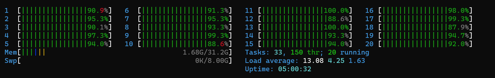

# Blazing Fast, Generic Library for Automated Feature and Model Selection

This library is designed to offer a blazing-fast, generic solution for automated feature and model selection, tailored for large datasets. By leveraging the power of Rust's parallelism and abstraction, alongside advanced model selection techniques, it streamlines the process of preparing data and choosing the optimal machine learning model with the best feature sets for your needs.

## Experiment run
| Model                | GA Time (s)    | GA MSE      | Baseline MSE | Features (Baseline/GA) | Generations | Population Size | k-Folds |
|----------------------|----------------|-------------|--------------|------------------------|-------------|-----------------|---------|
| LinearRegression     | 16.51424405    | -0.20968826 | -0.24114878  | 30/16                  | 100         | 50              | 2       |
| DecisionTreeRegressor| 150.815264143  | -0.2097171  | -0.2413631   | 30/12                  | 100         | 50              | 2       |

## Key Features

### Data Parallelism and Dataset Abstraction
- Provides a **unified interface** for interacting with various datasets, whether part of `smartcore::dataset`, stored locally, or distributed across a network. This abstraction simplifies data handling and ensures efficient processing across different storage solutions.

### Model Parallelism
- Employs model parallelism to distribute the training of complex models across multiple computing nodes, significantly reducing training times and facilitating the handling of larger, more intricate models.

### Cross-Validation and Genetic Algorithms
- Utilizes cross-validation techniques to ensure the reliability and generalizability of the model evaluation process.
- Incorporates genetic algorithms for feature selection, offering a sophisticated approach to identifying the most effective features for model training.

### Parallelism and Pipelining Across Feature Selection Stages
- Enhances the efficiency of the feature selection process through parallelism and pipelining, ensuring the rapid identification of the most relevant features for your models.

## Roadmap (Todo)
- **Data Loading**: Enable actual loading of datasets from both network sources and local storage, with storage links for seamless data integration.
- **Model Generality and Flexibility**: Refactor the current system to make model handling truly generic, adding support for more machine learning models from various libraries.
- **Model Classification and Metrics**: Analyze and classify different models based on their performance, focusing on metrics-wise evaluation for better decision-making.
- **Advanced Genetic Algorithm Features**: Integrate sophisticated genetic algorithm features, such as elitism, to enhance the effectiveness and efficiency of the selection process.
- **Contributor-Friendly Modularity**: Continue to develop a modular codebase that encourages and simplifies contributions across various aspects of the library.
- **User Interface Enhancements**: Develop a more user-friendly CLI and output system, making the library more accessible and easier to use for a broader audience.
- **Frontend Visualization**: Explore the creation of a frontend interface to visualize the feature and model selection process, offering users insight into the decision-making behind the scenes.

## Getting Involved
Contributions to this project are highly welcome. We value a modular, contributor-friendly approach that allows for easy integration and testing of new features, models, and data sources. Whether you're looking to fix bugs, propose new features, or enhance the documentation, your input is invaluable. Check out our issues list for areas where you can help, or feel free to suggest new ideas for the project.

## License
This project is licensed under the MIT License - see the LICENSE file for details.
